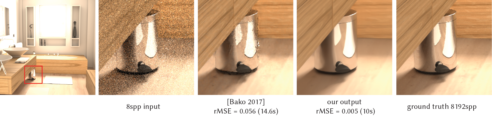

# Sample-based Monte Carlo Denoising using a Kernel-Splatting Network



Michaël Gharbi (<mgharbi@adobe.com>), Tzu-Mao Li, Miika Aittala, Jaakko
Lehtinen, Frédo Durand

Check out our [project page](http://groups.csail.mit.edu/graphics/rendernet/).


## Quick start

The quickest way to get started is to run the code from a Docker image. Proceed
as follows:

1. Download and install Docker <https://www.docker.com/> on your machine.

2. To enable GPU acceleration in your Docker instance, install the NVidia
   container toolkit: <https://github.com/NVIDIA/nvidia-docker>.
   We provide a shortcut to install the latter:

   ```shell
   make nvidia_docker 
   ```

3. Once these prerequisites are installed, you can build a pre-configured Docker image
and run it:

    ```shell
    make docker_build
    make docker_run
    ```

    If all goes well, this will launch a shell on the Docker instance and you
    should not have to worry about configuring the Linux or Python environment.

4. (optional) From within the running Docker instance, run the package's tests:

    ```shell
    make test
    ```

5. Again, within the Docker instance. Try a few demo commands, e.g. run a pretrained denoiser on a test input:

    ```shell
    make demo/denoise
    ```

    See below, or have a look at the `Makefile` for more `demo/*` commands you can try.


## Docker-less installation and dependencies

If you just intend to install our library, you can run:

```shell
HALIDE_DISTRIB_DIR=<path/to/Halide> python setup.py install
```

from the root of this repo. In any cases the docker file in `dockerfiles`
should help you configure your runtime environment.

We build on the following dependencies:

- Halide: our splatting kernel operator is implemented in Halide
<https://halide-lang.org/>. The `setup.py` script looks for the path to the Halide
distribution root under the environment variable `HALIDE_DISTRIB_DIR`. If this variable
is not defined, the script will prompt you whether to download the Halide
locally.
- Torch-Tools: we use the `ttools` library for PyTorch helpers and our training
and evaluation scripts <https://github.com/mgharbi/ttools>. This should get installed
automatically when running `python setup.py install`.


## Demo

We provide a patch to PBRTv2's commit #e6f6334f3c26ca29eba2b27af4e60fec9fdc7a8d
<https://github.com/mmp/pbrt-v2> in `pbrt_patches/sbmc_pbrt.diff`. This patch
contains our modification to the renderer to save individual samples to disk.


### Render samples from a PBRTv2 test scene

To render samples as `.bin` files from a `.pbrt` scene description, use the
`scripts/render_samples.py` script. This script assumes the PBRT scene file
contains only the scene description. It will create the apropriate header
description for the camera, sampler, path-tracer, etc. For an example, try:

```shell
make demo/render_samples
```


### Generating new random scenes for training

In the manuscript we described a scene generation procedure that used the 
SunCG dataset. Because of the legal issues that were later discovered with 
this dataset, we decided to no longer support this source of training scenes.

You can still use our custom, outdoor random scenes generator to generate
training data, `scripts/generate_training_data.py`. For an example, run:

```shell
make demo/generate_scenes
```

### Visualizing the image content of .bin sample files.

We provide a helper script to inspect the content of .bin sample files, `scripts/visualize_dataset.py`.
For instance, to visualize the scenes generate in the previous section, run:

```shell
make demo/visualize
```

### Run pretrained models

To run a pre-trained model, use `scripts/denoise.py`. The command below runs
our model and that of [Bako2017] on a test image:

```shell
make demo/denoise
```

### Comparisons to previous work

In the dockerfile, we setup the code from several previous work to facilitate
comparison. We provide our modifications to the original codebases as patch
files in `pbrt_patches/`. The changes are mostly simple modification to the C++
code so it compiles with gcc.

The comparison include:
* [Sen2011] "On Filtering the Noise from the Random Parameters in Monte Carlo Rendering"
* [Rousselle2012] "Adaptive Rendering with Non-Local Means Filtering"
* [Kalantari2015] "A Machine Learning Approach for Filtering Monte Carlo Noise"
* [Bitterli2016] "Nonlinearly Weighted First-order Regression for Denoising Monte Carlo Renderings"
* [Bako2017] "Kernel-Predicting Convolutional Networks for Denoising Monte Carlo Renderings"

To run the comparisons:

```shell
make demo/render_reference
make demo/comparisons
```


### Training a new model

To train your own model, you can use the
script `scripts/train.py`. For instance,
to train our model:

```shell
make demo/train
```

Or to train that of Bako et al.:

```shell
make demo/train_kpcn
```

Those scripts will also launch a Visdom server to enable you to monitor the
training. In your web browser, to view the plots navigate to <http://localhost:2001>.


### Numerical evaluation

The script `scripts/compute_metrics.py` can be used to
evaluate a set of .exr renderings numerically. It will print out
the averages and save the result to .csv files.

For example, you can download the renderings we produced for our paper evaluation
and compute the metrics by running:

```shell
make demo/eval
```


## Precomputed .exr results from our submission

We provide the pre-rendered .exr results used in our Siggraph submission
on-demand. To download them, run the command below. Please note this data is
rather large (54 GB).

```shell
make precomputed_renderings
```


## Test scene for evaluation

You can download the .pbrt scenes we used for evaluation by running:

```shell
make test_scenes
```

This will only download the scene description and assets. The images (or
samples) themselves still need to be rendered from this data, using the
`scripts/render_exr.py` and `scripts/render_samples.py` scripts respectively.


## Samples data: our .bin fileformat

Some sample data used throughout the `demo` commands can be downloaded using:

```shell
make demo_data
```


## Pretrained models

Download our pretrained models with the following command:

```shell
make pretrained_models
```
